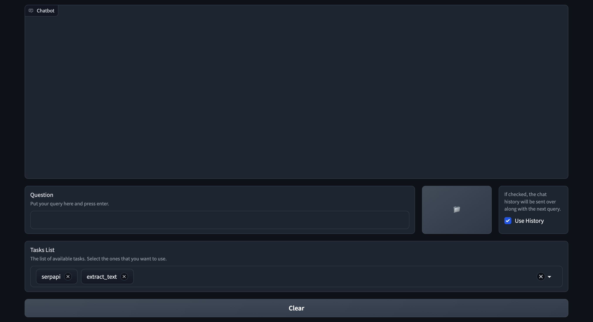

Quick Start
===========
* [Documentation page](https://docs.opencha.com)
* [User Guide](https://docs.opencha.com/user_guide/index.html)
* [How to Contribute](https://docs.opencha.com/user_guide/contribute.html)
* [API Docs](https://docs.opencha.com/api/index.html)
* [Examples](https://docs.opencha.com/examples/index.html)

To use CHA in a safe and stable way, ensure you have Python 3.10 or higher installed. First, create a virtual environment:

```python
# Create the virtual environment
python -m venv /path/to/new/virtual/environment

# Activate the virtual environment
source /path/to/new/virtual/environment/bin/activate
```

Now, install the CHA package. Unfortunately, currently due to PyPi registration problem, we could not upload our package to be
installed via pip directly. For now you can simply clone our code and do the installation as follows:

```bash
git clone https://github.com/Institute4FutureHealth/CHA.git
cd CHA
pip install '.[all]'
```

To simplify installation with minimum requirements and be ready to go, you can use the following command. This installs OpenAI, React Planner, as well as SerpAPI (search) and Playwright (browser) tasks:

```bash
pip install '.[minimum]'
```

If you want to install all requirements for all tasks and other components, use the following command:

```bash
pip install '.[all]'
```

After installing the package, based on what tasks you want to use, you may need to acquire some api_keys. For example, to get started using openAI GPT3.5 model as LLM in CHA, you need to signup
in their website and get the api_key. Then you should add openAI api_key as environment vairable in your terminal:

```bash
export OPENAI_API_KEY="your api_key"
```

The same goes for using tasks like SerpAPI:

```bash
export SERPAPI_API_KEY="your api_key"
```

Finally, you can start running our framework with the following simple code:

```python
from src.CHA import CHA

cha = CHA()
cha.run_with_interface()
```

This code will run the default interface, and you can access it at the following URL:

**http://127.0.0.1:7860**

For more examples, visit the [Examples page](https://docs.opencha.com/examples/index.html).


