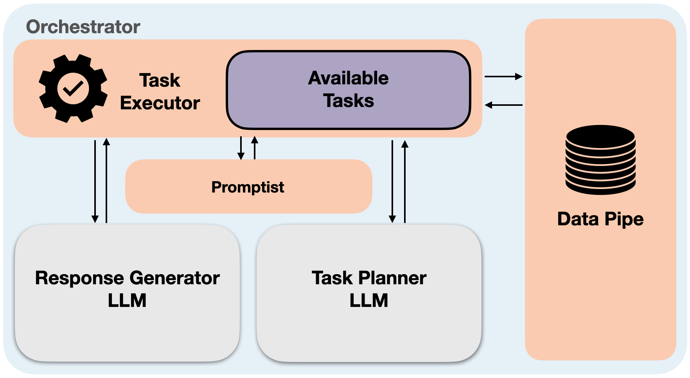

Orchestrator
============

The **Orchestrator** is responsible for problem solving and decision making to provide an appropriate response based on the user query. \
It incorporates the concept of the Perceptual Cycle Model, allowing it to perceive, transform, and analyze the world (i.e., input query and metadata) \
to generate appropriate responses. To this end, the input data are aggregated, transformed into structured data, and then analyzed to plan and execute actions. \
Through this process, the Orchestrator interacts with external sources to acquire the required information, perform data integration and analysis, 
and extract insights, among other functions. In the following, we outline five major components of the Orchestrator.

The **Task Executor** carries out actuation within the Orchestrator by following the decision-making process determined by the **Task Planner** and invoking a module upon request. 
The **Task Executor** has two primary responsibilities. First, it acts as a data converter, translating the input multimedia data into prompts. 
When the Task Executor receives user queries, which may include text, audio, and more, it calls relevant external platforms to convert them into text. 
For instance, it utilizes a Speech-to-Text tool to transcribe audio into text. Additionally, if the question is in a language other than English, 
it will be translated into English using the Google Translate service. Subsequently, the Task Executor translates the text into appropriate prompts by calling the **Promptist** and sends the prompts to the **Task Planner**.

    **The Orchestrator components. Each of these components have separate folders in the code base.**

.. toctree::
    :maxdepth: 1

    orchestrator
