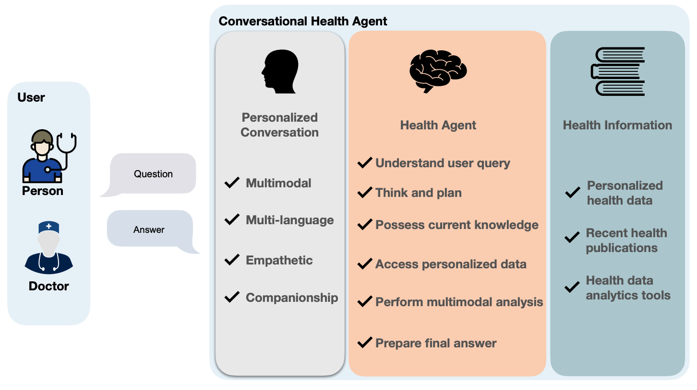

.. CHA documentation master file, created by
   sphinx-quickstart on Wed Nov  8 13:55:07 2023.
   You can adapt this file completely to your liking, but it should at least
   contain the root `toctree` directive.

Conversational Health Agents: A Personalized LLM-Powered Agent Framework
========================================================================

Conversational Health Agents (CHAs) are interactive systems designed to enhance personal healthcare services
by engaging in empathetic conversations and processing multimodal data.
While current CHAs, especially those utilizing Large Language Models (LLMs), primarily focus on conversation,
they often need more comprehensive agent capabilities. This limitation includes accessing personal user health data from wearables,
ubiquitous data collection sources, and electronic health records, integrating the latest published health insights, 
and connecting with established multimodal data analysis tools. 
In this paper, we propose an LLM-powered framework to empower CHAs to generate a personalized response for users' healthcare queries. 
This framework provides critical thinking, knowledge acquisition, and problem-solving abilities by integrating healthcare data sources, 
enabling multilingual and multimodal conversations, and interacting with various user data analysis tools. 
We illustrate the framework's proficiency in handling complex healthcare tasks via a case study on stress level estimation, 
showcasing the agent's cognitive and operational capabilities.

User Guide
----------

Information about using, configuration, and customizing CHA.

.. toctree::
   :maxdepth: 2
   
   user_guide/index

Api Doc
-------

The content of the exposed CHA API.

.. toctree::
   :maxdepth: 1

   api/index

Examples
--------

Several example pages to demonstrate the functionality of CHA.

.. toctree::
   :maxdepth: 2

   examples/index

   

..
   Indices and tables
   ==================

   * :ref:`genindex`
   * :ref:`modindex`
   * :ref:`search`

