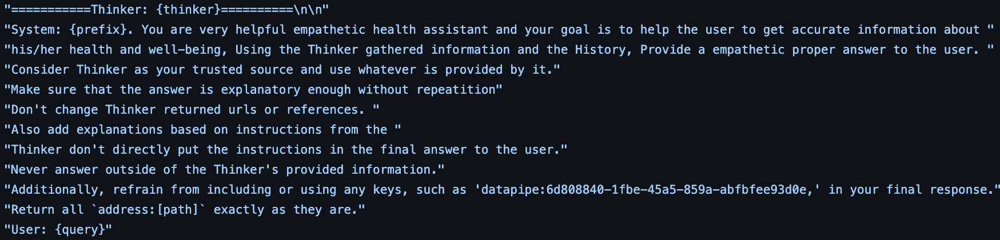

.. _response_generator:

Implementation of the Response Generator
==================================================

In this tutorial, we provide a detailed explanation of the Response Generator's implementation within our framework. We will first differentiate between the Response Generator and the Task Planner, demonstrate how the outcomes of planning and task execution are fed into the Response Generator, and finally, present the prompts used to guide the Response Generator's operations.

Distinction and Workflow
------------------------

The Response Generator is distinct from the Task Planner; the former focuses on generating user-facing responses based on the outcomes provided by the latter. Following the task planning and execution:

1. **Task Planning and Execution**: The Task Planner determines the sequence of tasks necessary to accurately address a user query.
2. **Compilation of Results**: Once planning is complete, the Orchestrator compiles the results of these tasks to create what we term the "mega prompt". This mega prompt dynamically incorporates all necessary information to allow the LLM to generate precise answers.

Mega Prompt Composition
-----------------------

The composition of the mega prompt is influenced by the nature of the tasks and their outputs. For instance:

- If a task's ``output_type`` is set to ``true``, indicating that the result should be stored in the Datapipe for subsequent analysis, the Orchestrator omits this result from the immediate prompt to the Response Generator, focusing instead on the final analysis outcomes.

- For tasks that produce metadata, such as an image, the metadata itself isn't passed directly to the Response Generator. Instead, descriptive information about the metadata, like details of a plot image and relevant data insights, are provided.

   The prompt provided to the Response Generator LLM. Initially, the Orchestrator formats answers derived from the task results, referred to as the "thinker" part of the prompt.

Operational Guidelines for the Response Generator
--------------------------------------------------

The LLM of the Response Generator is instructed to rely exclusively on the "thinker" prompt derived from the task results, disregarding its internal knowledge base to ensure that responses are based strictly on external data inputs:

- **Exclusive Dependency on Task Outcomes**: The LLM is guided to focus solely on the information presented in the thinker prompt, disregarding any internal knowledge it might possess.
- **Guidelines for System Implementations**: We include guidelines to help the LLM understand specific system implementations, such as Datapipe access keys or details about the metadata.

Customization Features
----------------------

In the openCHA framework, this prompt is customizable:

- **Prefix Feature**: A "prefix" feature allows developers to add specific information to better align the response generator with their specific task requirements, enhancing the relevance and accuracy of the generated responses.

.. note::
   This setup allows for high flexibility in configuring the Response Generator to meet diverse application needs, ensuring that responses are both relevant and contextually accurate.
