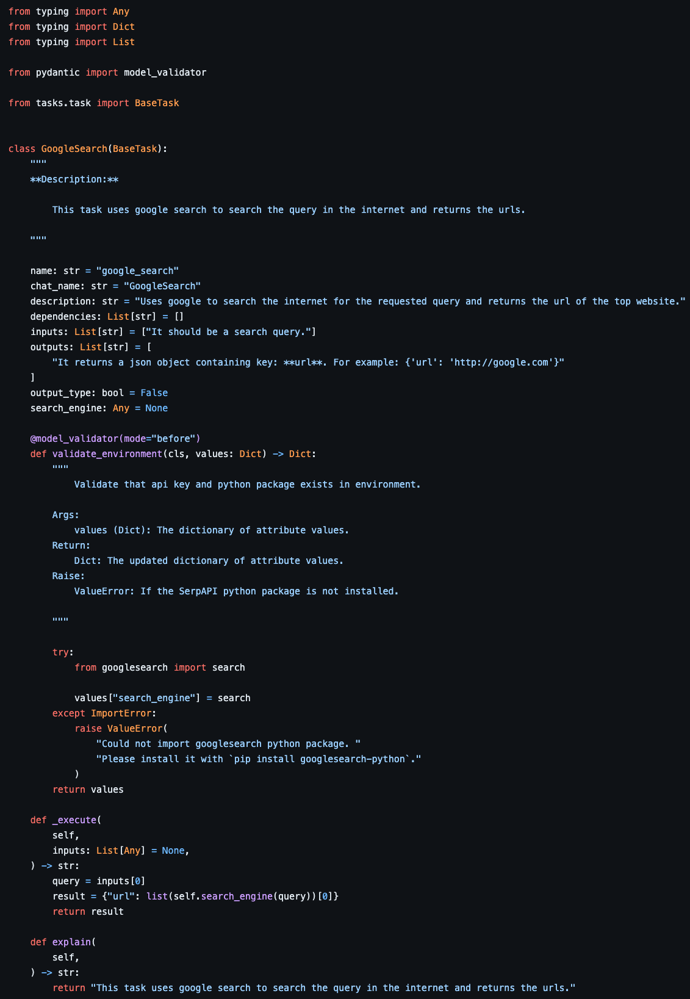

.. _task:

Create a New Task
====================

In this tutorial, we detail the adding of tasks within the openCHA framework and their introduction as external sources to the Task Planner. We will describe the types of tasks that can be added to the framework, outline the implementation process for tasks, and present an example of a task that has been implemented, along with sample prompts associated with it.

Types of Implementation
-----------------------

Tasks may be implemented locally or as a service:

- **Local Implementation**: This involves coding all necessary components on-site to ensure successful task execution. This may involve providing a Python library, a GitHub repository, or a complete task implementation.

- **Service-based Implementation**: This involves hosting services on a server and offering APIs for utilization. The service provider is responsible for maintaining the task and providing comprehensive documentation for users, including registration procedures, API key acquisition, and privacy policies.

Task Example
------------

   An example of a task implementation in openCHA designed to perform a Google search and return the first search result URL.

First you need to create a python file inside the **tasks** folder. If your task is a complecated task which contains multiple python files, create a new folder inside the **tasks** folder.
The main task implementaion should inherit from `tasks.task.BaseTask` from the `task.py` file. This file contains some high level implementations and abstract methods which needs to be implemented by you for your specific task.
The configuration parameters inside the task file which you need to implement in openCHA framework are as follows:

**name**
  Purpose:
    Uniquely identifies the task within the system; this name will appear in the interface for task selection.

  Convention:
    Generally in lowercase underscore_case, often derived from the task's functionality for better readability and maintainability.

  Example:
    ``name = "google_search"``

**chat_name**
  Purpose:
    Used for referencing the task in user interfaces or chats, particularly for explainability.

  Convention:
    Typically in CamelCase, should be descriptive yet concise.

  Example:
    ``chat_name = "GoogleSearch"``

**description**
  Purpose:
    Provides an explanation of the task's function and helps the Task Planner LLM decide when to deploy the task.

  Convention:
    The description should be comprehensive, outlining task capabilities, prioritization, or specific conditions for its use.

  Example:
    ``description = "Uses Google to search the internet for the requested query and returns the URL of the top website."``

**dependencies**
  Purpose:
    Lists other tasks or services this task depends on, informing the Task Planner LLM of these dependencies during planning.

  Convention:
    An array of task identifiers that match the name attribute of dependent tasks.

  Example:
    ``dependencies = ['fetch_weather_data']``

**inputs**
  Purpose:
    Specifies the inputs required by the task.

  Convention:
    An array of strings, each describing a specific input.

  Example:
    ``inputs = ['It should be a search query.']``

**outputs**
  Purpose:
    Details what the task returns, assisting the Task Planner LLM in understanding the return structure.

  Convention:
    An array of strings describing each output, with a full description of the return data format.

  Example:
    ``outputs = ["It returns a JSON object containing key: url. For example: {'url': 'http://google.com'}"]``

**output_type**
  Purpose:
    Instructs the Orchestrator on how to handle the output of this task.

  Convention:
    Boolean values (True or False).

**_execute Function**
  Purpose:
    This function must be implemented correctly. It is invoked by the Task Planner LLM with the appropriate inputs.

  Example:
    The "_execute" function, utilizing the google_engine Python library, searches for the query online and returns the URL. This aligns with the "outputs" parameter, demonstrating coherence between the task setup and its execution.

After defining your task, you need to register it inside the task pool to be accessible through the interface as well as the Task Planner.
To do so, you need to introduce your new task in the tasks list and point to your main class file. First, edit **task_types.py** file.

Tasks Types
-----------

This enumeration class defines different types of task. This ensures consistency in case the task developer
decides to change the name of their task, the end user need not to change their code cause they use the **keys**.
It inherits from the `str` class and the `Enum` class in Python's `enum` module.
Each value in this enumeration represents a specific type of task. The **key** naming convention should be all uppercase with underscore,
and the **value** naming convention should be underscore_case: `NAME_OF_TASK = this_is_a_sample_task_name`

.. literalinclude:: ../../../tasks/task_types.py
    :language: python

|

The last step is to point the key you created to the main class of your task implementation by editing the **types.py** file.

Types
-----

This dictionary is used to map each TaskType value to its corresponding Task class.
It allows for easy retrieval of the appropriate class based on the planner type.

.. literalinclude:: ../../../tasks/types.py
    :language: python

After doing these steps, you should be able to see your new task in the task list inside the interface and also you can use the key to add it as available tasks in the without interface mode.
