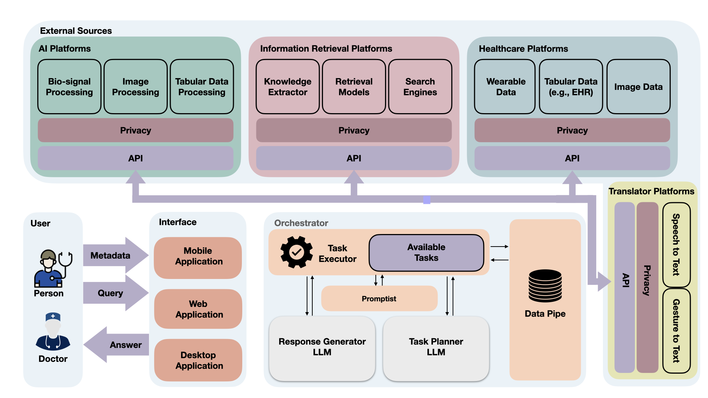

Introduction
============
For detailed information you can see our framework paper: `Paper <https://arxiv.org/abs/2310.02374>`_

We design an LLM-powered framework leveraging a service-based architecture with a central agent that perceives and analyze user queries, provides appropriate response, \
and manages access to external resources through Application Program Interfaces (APIs). \
The user-framework interaction is bidirectional, ensuring a conversational tone for ongoing and follow-up conversations. Following are the main components of the CHA:

Interface
---------
**Interface** acts as a bridge between the users and agents, including interactive tools accessible through mobile, desktop,\
or web applications. It integrates multimodal communication channels, such as text and audio. \
The Interface receives users' queries and subsequently transmits them to the **Orchestrator**. \
It is noteworthy that questions can be presented in various modes of human communication, such as text, speech, or gestures.

Users can provide metadata (alongside their queries) within this framework, including images, audio, gestures, and more. \
For instance, a user could capture an image of their meal and inquire about its nutritional values or calorie content, with the image serving as metadata. \
In this open-source version, we are using Gradio as our Interface to make it easier for other contributers to start contributing.

Orchestrator
------------

The **Orchestrator** is responsible for problem solving and decision making to provide an appropriate response based on the user query. \
It incorporates the concept of the Perceptual Cycle Model in CHAs, allowing it to perceive, transform, and analyze the world \
(i.e., input query and metadata) to generate appropriate responses. To this end, the input data are aggregated, transformed into structured data, \
and then analyzed to plan and execute actions. Through this process, the Orchestrator interacts with external sources to acquire the required information, \
perform data integration and analysis, and extract insights, among other functions. In the following, we outline five major components of the Orchestrator.

The **Task Executor** carries out actuation within the Orchestrator by following the decision-making process determined by the Task Planner and invoking a module upon request. \
The Task Executor has two primary responsibilities. First, it acts as a data converter, translating the input multimedia data into prompts. When the Task Executor receives user queries, \
which may include text, audio, and more, it calls relevant external platforms to convert them into text. For instance, it utilizes a Speech-to-Text tool to transcribe audio into text. \
Additionally, if the question is in a language other than English, it will be translated into English using the Google Translate service. \
Subsequently, the Task Executor translates the text into appropriate prompts by calling the \textit{Promptist} and sends the prompts to the Task Planner.

Secondly, the Task Executor fulfills the commands the Task Planner generates by interfacing with external sources. The results are then relayed to the Task Planner for further analysis and decision-making. \
For instance, if the Task Planner sends a request to determine if an Electrocardiogram (ECG) signal (provided metadata) contains atrial fibrillation, the Task Executor engages an ECG arrhythmia detection module \
(in AI Platform), and the results are sent back to the Task Planner.

The **Task Planner** is the LLM-enabled decision-making core of the Orcestrator. \
Its primary responsibility is to generate a procedure to extract the required information for a response. \
To achieve this, it interprets the user's query and accompanying metadata, identifying the necessary steps for execution. \
Let's consider an example for clarification. The user inquires about her sleep quality, whether it can be improved, \
and if any action is necessary. The Task Planner selects the appropriate procedure to provide an answer, drawing from available external sources. \
It first examines the metadata if it includes last night's sleep data. Next, it requests analytical procedures (e.g., in AI Platforms) \
to extract sleep parameters, including sleep duration and wakefulness after sleep onset. Once the required information is obtained, \
it then requests the retrieval of the most relevant information from online resources to provide an interpretation of sleep quality based on the obtained parameters.

To transform a user query into a sequence of tasks, we used the ReAct model. \
ReAct employs reasoning and action techniques to ascertain the essential actions to be undertaken. \
An alternative model for task planners is the Plan-and-Solve Prompting. It is a form of chain-of-thought prompting that instructs the LLM model to devise a plan for generating the answer and subsequently \
take action based on the devised plan. Additionally, Modular Reasoning, Knowledge, and Language (MRKL) can be used, which is linked to a set of predefined modules and can call upon them as needed.

It is crucial to emphasize that communication between the task planner and task executor is bidirectional. An iterative process continues between the Task Executor and \
Task Planner until the Task Planner accumulates sufficient information to respond appropriately to the user's inquiry. This two-way exchange proves indispensable because, \
in specific scenarios, the Task Planner may necessitate intermediate information to determine subsequent actions.

The **Data Pipe** is a repository of metadata and data acquired from External Sources through the execution of conversational sessions. \
This component is essential because numerous multimodal analysis involve intermediate stages, and their associated data must be retained for future retrieval.

The **Promptist** is responsible for transforming text or outcomes from External Sources into suitable prompts that can be supplied to either the Task Planner or the Response Generator.

The **Response Generator** is an LLM-based module responsible for preparing the response. It refines the gathered information by the Task Planner, \
converting it into an understandable format and inferring the appropriate response. This module is trained to address `empathy` and `companionship` in conversations. \
Notably, in some instances, the Task Planner and the Response Generator may share the same LLM.

External Sources
----------------
**External Sources** play a pivotal role in obtaining essential information from the broader world. \
Typically, these External Sources furnish application program interfaces (APIs) that the Orchestrator can use to retrieve required data, \
process them, and extract meaningful health information. As previously mentioned, the Task Executor calls the APIs, i.e., \
the Orchestrator's actuation component. Our framework integrates with four primary external sources, which we found critical for conversational health agents.

**Healthcare platforms** enable the collection, ingestion, and integration of data captured from a variety of sources, such as Electronic Health Record (EHR), \
smartphones, and smartwatches, for healthcare purposes. Such platforms have garnered significant attention in the recent wave of healthcare \
digitalization, enabling ubiquitous health monitoring. The data encompass various modalities, including biosignals (e.g., PPG collected via a smartwatch), \
images (e.g., captured via user's smartphone), videos, tabular data (e.g., demographic data gathered from EHR), and more.
Notable examples of such healthcare platforms include ZotCare and ilumivu, offering APIs for third-party integration. In our context, the Orchestrator functions as a third party, \
accessing user data with their consent to facilitate personalization within our healthcare chatbot.

**Information retrieval platforms** fetches the most current and pertinent data from healthcare sources, such as healthcare literature, reputable websites, \
or knowledge graphs using search engines or retrieval models. Accessing this retrieved information equips CHAs with up-to-date, personalized knowledge, \
enhancing its trustworthiness while reducing hallucination and bias. Let's consider a scenario for stress level estimation where the Task Planner lacks knowledge of stress measurement methods. \
In response, it requests a search for recent documents on stress measurement techniques through the retrieval platforms.

**AI platforms** provide data analytics tools to extract information, associations, and insights from data, playing a crucial role in the evolving landscape of LLM-healthcare integration, \
enhancing trustworthiness and personalization. They can perform various tasks, including data denoising, abstraction, classification, and event detection, to mention a few. \
As generative models, LLMs cannot effectively perform extensive computations or act as machine learning inferences on data. The AI platforms empower our framework to leverage existing health data analytic approaches.

**Translator Platforms** effectively convert various languages into widely spoken languages such as English, thereby enhancing the accessibility and inclusivity of CHAs. \
Existing agents face limitations that hinder their usability for large communities globally. Assuming universal text literacy for CHAs often narrows their reach and positioning them as a privilege. \
Many underserved communities face obstacles while using CHAs due to their educational disparities, financial constraints, and biases that favor developed nations within existing technological paradigms. Our framework, \
which integrates with Translator platforms, is designed to accommodate and support communication with diverse communities. This integration not only enhances the overall usability of CHAs but also ensures that they can effectively \
serve a broader range of users with varying linguistic and cultural backgrounds.

It is crucial to note that privacy and security are essential issues in this framework since healthcare applications must address users' privacy concerns. \
Robust privacy measures are crucial for preventing unauthorized access, data breaches, and identity theft, which can have severe consequences for patients and healthcare providers. \
Before transferring data from External Sources to the Orchestrator, we will employ data de-identification and anonymization to ensure privacy. \
For example, in this data transformation process, GPS coordinates are converted into more generalized labels like 'home,' 'gym,' and 'work' within the Healthcare Platform. \
Moreover, we will ensure secure data transmission between the Orchestrator and External Sources by implementing cryptographic tools~\cite{yakoubov2014survey}.
