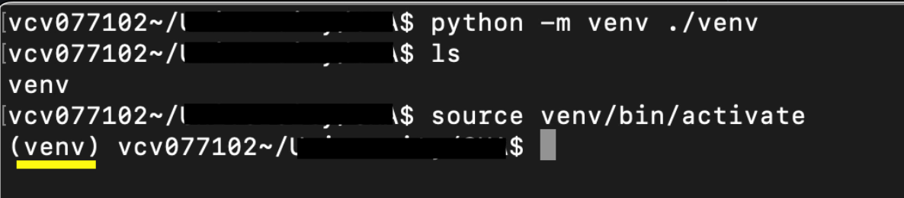
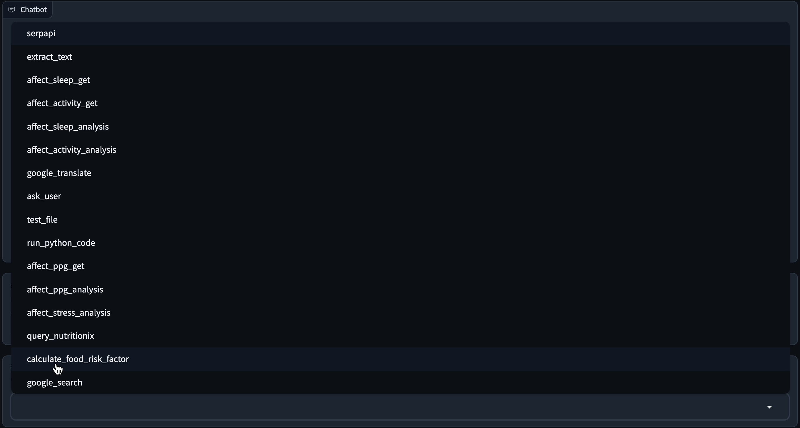
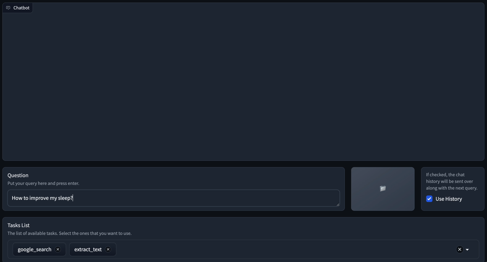
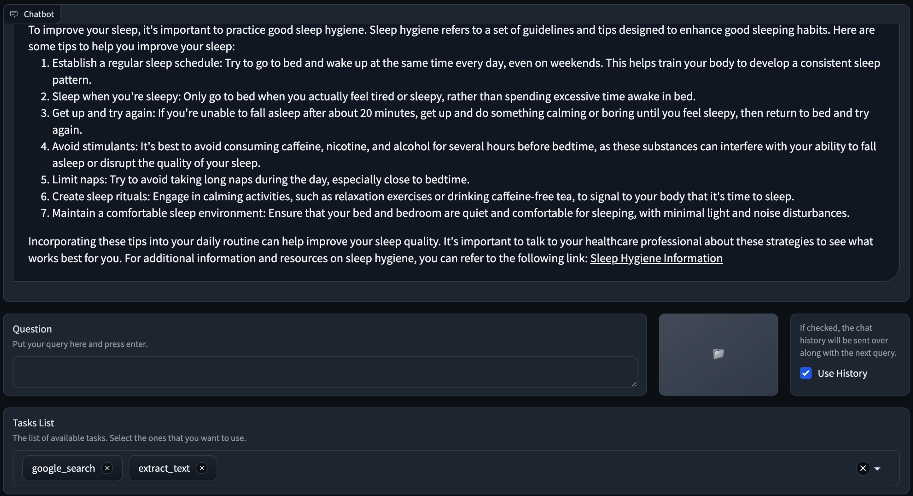
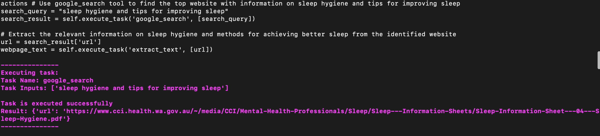

.. _quick_start:

Quick Start
============

To use the CHA in a safe and stable way make sure you have **python3.10** and higher. First create a virtual env.

.. code-block:: python

  #create the venv
  python -m venv /path/to/new/virtual/environment
  #activate the venv
  source activate /path/to/new/virtual/environment/bin

You should now be able to see the environment showing in your terminal.

Now install the CHA package:

This command only installs the based requirements and later you need to install different packages needed based on tasks, planner, response generator, and llm types you want to use

.. code-block:: bash

  git clone https://github.com/Institute4FutureHealth/CHA.git
  cd CHA

To make it easier, you can use the following command to install the minimum requirments and ready to go. This will \
install openai, tree of thought planner, as well as serpapi (search), and extract_text tasks.

.. code-block:: bash

  pip install '.[minimum]'

If you want to install all requirements for all tasks and other components, use the following command:

.. code-block:: bash

  pip install '.[all]'

After installing the package, based on what tasks you want to use, you may need to acquire some api_keys. For example, to get started using openAI GPT3.5 model as LLM in CHA, you need to signup
in their website and get the api_key. Then you should add openAI api_key as environment vairable in your terminal:

.. code-block:: bash

  export OPENAI_API_KEY="your api_key"

The same goes for using tasks like SerpAPI:

.. code-block:: bash

  export SERPAPI_API_KEY="your api_key"

To make the `extract_text` work, you need to also install playwright using playwright command. Run the following command in your terminal:

.. code-block:: bash

  playwright install

Finally, you can start running our framework with the following simple code:

.. code-block:: python

  from CHA import CHA

  cha = CHA()
  cha.run_with_interface()

This code will run the default interface. You can route to the following url:

**http://127.0.0.1:7860**

The openCHA back-end starts running

.. figure:: ../../figs/Interface.png
    :alt: Interface
    :align: center

To start interacting with openCHA and make sure everything is working correctly, from the **Tasks List** selece `google_search` and `extract_text`. Then, in the Question box ask your questions like `How to improve my sleep`.

When the answer is ready, the answer will be shown in the chatbot box:

For debugging matters, your can check the terminal logs which logs all the process happening in the terminal. Each component log has different colors. For example, the tasks' execution logs are **purple**.

For more examples go to the Examples page: :ref:`examples`

Checkout our youtube video to see the setup in action:

.. youtube:: hx6F-P8Q-O0
